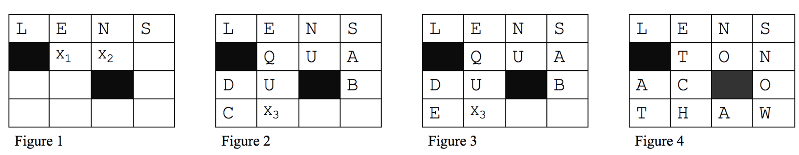

# CS 1501 – Algorithm Implementation – Assignment #1 

*This assignment is adapted from Dr. John Ramirez’s CS 1501 class.*

Due: Friday October 1st @ 11:59pm on Gradescope

Late submission deadline: Sunday October 3rd @11:59pm with 10% penalty per late day

## Overview
 
* __Purpose__:  To implement a backtracking algorithm.
* __Task__: The main task of the assignment is to create a backtracking algorithm that finds one legal filling of the squares of a given crossword puzzle and the score of a filling (if a legal filling exists), as specified in detail below.

## Background

Crossword puzzles are challenging games that test both our vocabularies and our reasoning skills.  However, creating a legal crossword puzzle is not a trivial task.  This is because the words both across and down must be legal, and the choice of a word in one direction restricts the possibilities of words in the other direction.  This restriction progresses recursively, so that some word choices "early" in the board could make it impossible to complete the board successfully.  For example, look at the simple crossword puzzle below (note: in this example X<sub>1</sub>, X<sub>2</sub>, X<sub>3</sub> are variables not the letter X):


 

Assume that the word LENS has been selected for row 0 of the puzzle, as shown in Figure 1 above.  Now, the word in column 1 (the second column) must begin with an E, the word in column 2 must being with an N and the word in column 3 must begin with an S. All single characters are valid words in our dictionary so the L in column 0 is a valid word but is also irrelevant to the rest of the puzzle, since its progress is blocked by a filled-in square.  There are many ways to proceed from this point, and finding a good way is part of the assignment.  However, if we are proceeding character by character in a row-wise fashion, we now need a letter X<sub>1</sub> such that EX<sub>1</sub> is a valid prefix to a word.  Several letters will meet this criterion (EA, EB and EC are all valid prefixes, just to pick the first three letters of the alphabet).  Once a possibility is selected, there are now two restrictions on the next character X<sub>2</sub>: NX<sub>2</sub> must be a valid word and X<sub>1</sub>X<sub>2</sub> must be a valid prefix to a word (see Figure 1). Assume that we choose Q for X<sub>1</sub> (since EQ is a valid prefix). We can then choose U for X<sub>2</sub>, (see Figure 2 (NU is a valid word in our dictionary)). Continuing in the same fashion, we can choose the other letters shown in Figure 2 (in our dictionary QUA, DU and DC are all legal words).

Unfortunately, in row 3, column 1 we run into a problem (Figure 3).  There is no word in our dictionary EQUX<sub>3</sub> for any letter X<sub>3</sub> (note that since we are at a terminating block, we are no longer just looking for a prefix) so we are stuck.  At this point we need to undo some of our previous choices (i.e., backtrack) in order to move forward again toward a solution.  If our algorithm were very intelligent, it would know that the problem that we need to fix is the prefix EQU in the second column .  However, based on the way we progressed in this example, we would simply go back to the previous square (row 3, column 0), try the next legal letter there, and move forward again.  This would again fail at row 3, column 1, as shown in Figure 3.  Note that the backtracking could occur many times for a given board, possibly going all the way back to the first word on more than one occasion.  In fact, the general run-time complexity for this problem is exponential.  However, if the board sizes are not too large, we can likely solve the problem (or determine that no solution exists) in a reasonable amount of time.  One solution (but not the only one) to the puzzle above is shown in Figure 4.

### Filled Puzzle Score
We are going to assign a score to each filled puzzle. The score is computed by adding up the letter points of all the letters on the filled puzzle. Assuming the letter points of the Scrabble game, the score of the puzzle of Figure 4 is computed as follows:

L+E+N+S+T+O+N+A+C+O+T+H+A+W = 1+1+1+1+1+1+1+1+3+1+1+4+1+4=22

## TASK - Finding a Single Solution

Your task in this assignment is to create a legal crossword puzzle (if it exists) and compute its score in the following way:

1. Read a dictionary of words in from a file and form a `MyDictionary` object of these words. The name of the dictionary file should be specified as a command-line argument. The interface `DictInterface` (in `DictInterface.java`) and the class `MyDictionary` (in `MyDictionary.java`) are provided for you in this repository, and you must use them in this assignment.  Read over the code and comments carefully so that you understand what they do and how.  The file used to initialize the `MyDictionary` object will contain ASCII strings, one word per line.  Use the file `dict8.txt`.  If you are unsure of how to use `DictInterface` and `MyDictionary` correctly, see the `DictTest.java` example program (and read the comments). Lab 1 solution can be used for reference as well.

2. Read a crossword board in from a file.  The name of the board file should be specified as a command-line argument.  The crossword board will be formatted in the following way:

    - The first line contains a single integer, N.  This represents the number of rows and columns that will be in the board.  Since the dictionary will contain up to 8-letter words, your program should handle crosswords up to 8x8 in size.
    - The next N lines will each have N characters, representing the NxN total locations on the board.  Each character will be either
      - `+` (plus) which means that any letter can go in this square
      - `–` (minus) which means that the square is solid (filled-in) and no letter can go in here
      - A..Z (a letter from A to Z) which means that the specified letter must be in this square (i.e., the square can be used in the puzzle, but only for the letter indicated)

For the board shown above, the board file sample.txt is as follows:
```
4
++++
-+++
++-+
++++ 
```

Some test boards have been put onto this repository. Please consult `testFiles.md` for an overview of these board files.

3. Create a legal crossword puzzle for the given board and print it out to standard output.  Many of the test files may have many solutions, but for this assignment, you only need to find one solution.  For example, one output to the crossword shown above in Figure 4 would be (note that the puzzle score is also printed):

```
> java Crossword dict8.txt sample.txt
LENS
-TON
AC-O
THAW
Score: 22
>
```

Depending upon your algorithm, the single solution that you find may differ from that of my program or your classmates' programs.  This is fine as long as all of the solutions are legal.  Note that because of the severe performance limitations of the `MyDictionary` class, some of the run-times for the test files will be very long.  See more details on this in `testFiles.html`. 


## Important Notes:

- For consistency, you **must** name your main program `Crossword.java`.
- When grading your assignments, your TAs may redirect your output to a file so that they can refer to it at a later point.  To make sure this will work correctly, make sure that once your search algorithm begins there is _NO INPUT_ or anything that would make your program require any user interaction (since the TA will not see any prompts given that they will be sent to a file rather than the display).
- To help you to get started, 
    * first think of boards with all squares open (you can consider filled in squares later). In this case a solution for a `KxK` board will consist of `K` words of length `K` in the columns of the board and `K` words of length K in the rows of the board. 
    * Your program has to make one decision for each square of the board. How many options do you have for each decision? What are these options? You will have to choose from the 26 letters.
    * Construct an array of K `StringBuilder`s for the columns (call it `colStr`) and an array of K `StringBuilder`s for the rows (call it `rowStr`), each initially empty. Now consider a single recursive call at square `(i,j)` on the board. For an option (i.e., a letter) at position `(i,j)` to be valid, the following must be true: 
      - If `j` is not an end index, then `rowStr[i]` + the letter a must be a valid prefix in the dictionary
      - If `j` is an end index, then `rowStr[i]` + the letter must be a valid word in the dictionary 
      - If `i` is not an end index, then `colStr[j]` + the letter must be a valid prefix in the dictionary 
      - If `i` is an end index, then `colStr[j]` + the letter must be a valid word in the dictionary
    * If the letter is valid, you append it to both corresponding `StringBuilder`s and recurse to the next square (unless you are on the last square of the board, in which case you have a solution!). If it is not valid you try the next character at that square or, if all have been tried, you backtrack. Refer to the backtracking template that we discussed in class.
- **Search algorithm details**: Carefully consider the algorithm to fill the words into the board.  Make sure it potentially considers all possibilities yet does not waste time rechecking prefixes that have already been checked.   Although you are not required to use the exact algorithm described above, your algorithm must be a recursive backtracking algorithm that uses pruning.  The algorithm you use can vary greatly in its efficiency.  If your algorithm is very inefficient or otherwise poorly implemented, you will lose some style points.  This algorithm is a significant part of the overall assignment, so put a good amount of effort into doing it correctly.  For guidance on your board-filling algorithm, it is strongly recommended that you revise the Boggle game lab code (Lab 1).
- The `MyDictionary` implementation of the `DictInterface` that is provided to you should work correctly, but it is not very efficient.  Note that it is doing a linear search of an `ArrayList` to determine if the argument is a prefix or word in the dictionary.  
-	Be sure to thoroughly document your code, especially the code that fills the board.

## Writeup

Once you have completed your algorithm, write a short paper (500-750 words) using [Github Markdown syntax](https://guides.github.com/features/mastering-markdown/) and named `a1.md` that summarizes your project in the following ways:
1.	Discuss how you solved the crossword-filling problem in some detail. Include
    * how you set up the data structures necessary for the problem and 
    * how your algorithm proceeded.  
    * Also indicate any coding or debugging issues you faced and how you resolved them.  If you were not able to get the program to work correctly, still include your approach and speculate as to what still needs to be corrected.
2.	Include the (approximate) run-times for the programs for the various files in a table.  
3.	Include an asymptotic analysis of the worst-case run-time of the program.  Some values to consider in this analysis may include:
    * Number of words in the dictionary
    * Number of characters in a word
    * Number of possible letters in a crossword location
    * Number of crossword locations in the puzzle

If you were unable to complete the crossword solving program, speculate (using some intelligent guessing) for the actual run-times.


## Submission Requirements

You must submit your Github repository to GradeScope. We will only grade the following files:
1)	Crossword.java
2)	Any other helper files that you had to add to support your implementation
3)	`a1.md`: A well written/formatted paper explaining your search algorithm and results (see the Writeup section above for details on the paper) 
4)	Assignment Information Sheet (including compilation and execution information).

_The idea from your submission is that your TA (and/or the autiograder if available) can compile and run your programs from the command line WITHOUT ANY additional files or changes, so be sure to test it thoroughly before submitting it. If the TA (and/or the autiograder if available) cannot compile or run your submitted code it will be graded as if the program does not work.
If you cannot get the programs working as given, clearly indicate any changes you made and clearly indicate why on your Assignment Information Sheet.  You will lose some credit for not getting it to work properly, but getting the main programs to work with modifications is better than not getting them to work at all.  A template for the Assignment Information Sheet can be found in this repository. You do not have to use this template, but your sheet should contain the same information._

_Note: If you use an IDE, such as NetBeans, Eclipse, or IntelliJ, to develop your programs, make sure the programs will compile and run on the command-line before submitting – this may require some modifications to your program (e.g., removing package information)._

## Rubrics 

__*Please note that if an autograder is available, its score will be used as a guidance for the TA, not as an official final score*__.

Item|Points
----|------
Basic search approach is correct|	10
Search works for board with all open squares|	20
Search works for board with filled in squares|	10
Algorithm works in an efficient manner|	10
Dictionary file read in/processed correctly|	5
Crossword file read in/processed correctly| 5
Output generated / formatted correctly|	10
Solution score computed correctly|	5
Write-up paper|	10
Code style and documentation|	10
Assignment Information Sheet|	5
